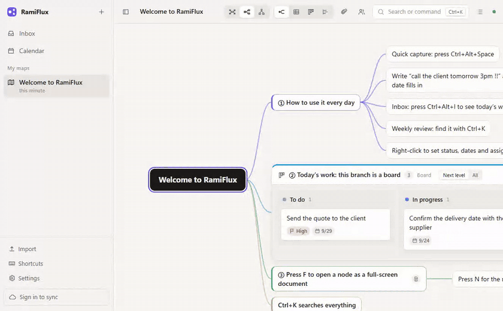
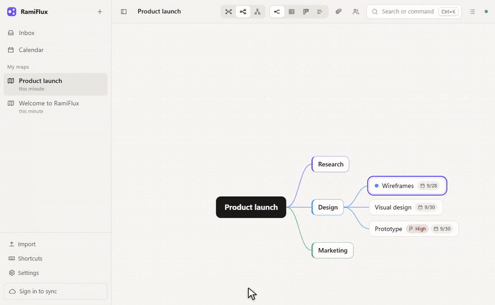
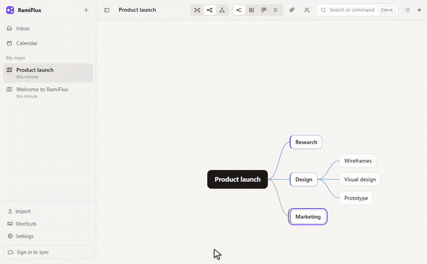
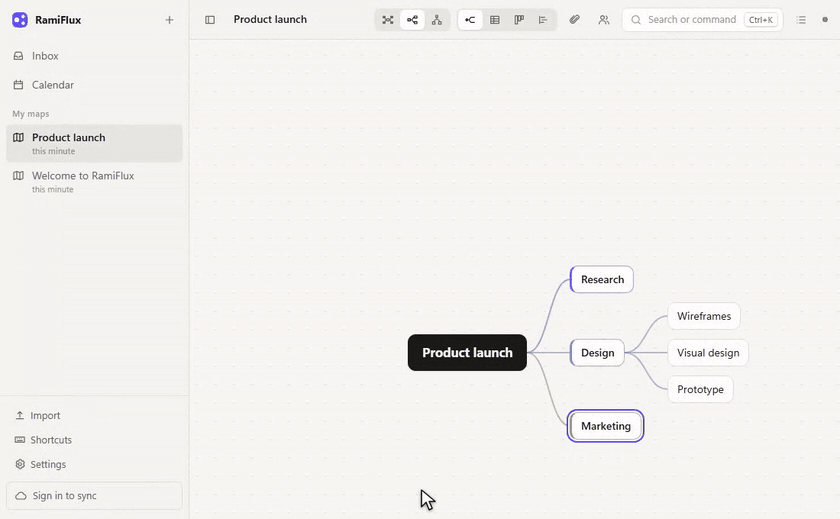
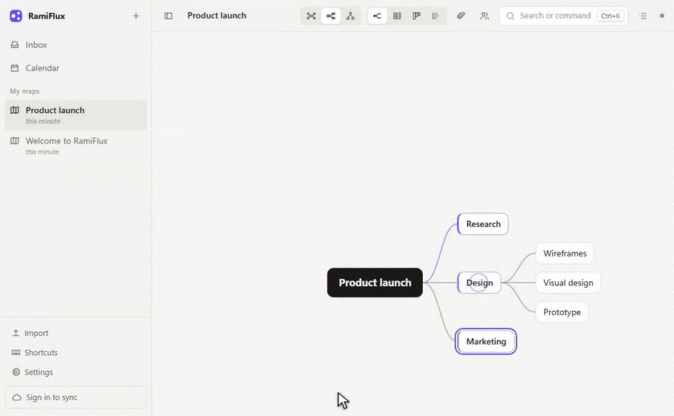

# RamiFlux

**Keyboard-first mind maps that turn into boards, tables, Gantt timelines and Notion-style documents.**
Local-first, end-to-end encrypted sync, plugins and an AI assistant. For Windows 10 and 11 and macOS.

  <a href="https://github.com/yunen0623/RamiFlux-releases/releases/latest"><strong>Download the latest version</strong></a>
  &nbsp;·&nbsp; installs for the current user in seconds &nbsp;·&nbsp; updates itself

RamiFlux is for people who plan in outlines and then have to run the plan: product managers, team leads, anyone
whose week is a mix of meetings, tasks and notes. One map holds it all. Every branch of that map can be looked at
as a mind map, a board, a table or a Gantt timeline, and every node can open as a full document.

---

## Think in a map, at typing speed

`Tab` adds a child, `Enter` a sibling, `Shift` + arrows reorders. Priorities, statuses, start and due dates,
assignees and predecessors live on every node and are one right-click away. Three layouts (balanced, left to
right, top down), an outline panel, multi-select with a marquee, and copy as picture: a selection pasted into
PowerPoint arrives as editable shapes.

## Any branch, any view

Select a branch and press `Alt+2` for a table, `Alt+3` for a board, `Alt+4` for a Gantt timeline; `Alt+1` is
the map again. Views are embedded right in the map, or focus on the branch and they fill the window. Tables get
their own custom columns, sorting and filtering. Boards move work between statuses. Gantt charts show the whole
branch as a work breakdown with milestones, predecessor arrows and drag-to-reschedule, and copy to PowerPoint as
one editable group.

## Notes that grow into documents

Press `F` on any node for a full-screen document. Markdown shortcuts as you type, a `/` menu for headings,
lists, to-dos, quotes, code with syntax highlighting, tables with Notion-style handles, columns, callouts,
toggles, equations and links to other nodes. Attachments preview in place: PDF, Word, Excel, PowerPoint, images,
video and audio, plus draw.io diagrams edited without leaving the app.

## Capture now, sort later

`Ctrl+Shift+N` inside the app, or `Ctrl+Alt+Space` from anywhere in Windows (`⌥⇧Space` on a Mac), opens
quick capture. Type in plain
language: *by Friday*, *tomorrow 3pm*, *every Monday*, `!!` for priority. Everything lands in the inbox, where
`M` moves an item under any node of any map. The weekly review gathers what was finished, what is overdue and
what is coming up across all your maps, ready to paste into an email. A calendar, due-time reminders with snooze
and a system tray icon keep the day on track.

## Let the AI do the tedious part

Paste meeting notes, a requirements document or a transcript (or pick an audio file to transcribe) and the
assistant proposes a task tree with priorities and due dates. Untick what you do not want, then add it under a
node or as a new map: one undo takes it all back. It also writes meeting minutes, summarises a node's notes and
answers questions about your maps using read-only lookups. Bring your own service: the Claude API, any
OpenAI-compatible endpoint (OpenAI, OpenRouter, Groq, a self-hosted Ollama or LM Studio) or an OAuth 2.0
gateway. Keys stay in your device's credential store (Windows Credential Manager or the macOS Keychain).

## Also in the box

- **Sync and sharing.** Sign in to sync every map across devices with end-to-end encryption; the server only
  ever stores ciphertext. Share a map read-only or for editing, assign work to teammates, send an item straight
  to someone's inbox, and see who is looking at what.
- **Plugins.** Sandboxed plugins add commands, views and automations. The built-in store offers Slack/Discord
  webhooks, calendar (ICS) subscriptions, GitHub Issues sync and a categorised weekly report; write your own
  against a documented API.
- **Backup and export.** Full backups with attachments as a single `.ramiflux` file, Markdown export, and
  import from backups or plain Markdown.
- **English and Traditional Chinese** interface, chosen automatically from the system language and switchable
  in Settings.

## Install

**Windows**

1. Download `RamiFlux_<version>_x64-setup.exe` from the [latest release](https://github.com/yunen0623/RamiFlux-releases/releases/latest).
2. Run it. The installer is not yet code-signed, so Windows SmartScreen may show *Windows protected your PC*;
   choose **More info → Run anyway**. It installs for the current user only and needs no administrator rights.
3. Requirements: 64-bit Windows 10 or 11 and the WebView2 runtime (included with Windows 11; the installer
   fetches it on Windows 10 if it is missing).

**macOS**

1. Download `RamiFlux_<version>_universal.dmg` from the [latest release](https://github.com/yunen0623/RamiFlux-releases/releases/latest) —
   one download for both Apple silicon and Intel.
2. Open it and drag **RamiFlux** into **Applications**.
3. The app is not signed with an Apple Developer ID, so macOS blocks the first launch: double-click RamiFlux
   and dismiss the warning, then go to **System Settings → Privacy & Security**, scroll down and choose
   **Open Anyway**. If macOS instead reports the app as damaged, run `xattr -cr /Applications/RamiFlux.app`
   in Terminal once and open it again. Later updates install through the app and need none of this.
4. Requirements: macOS 11 Big Sur or later.

RamiFlux checks for updates when it starts and in **Settings → About**. Update packages are signed and the
signature is verified before anything is installed. An `.msi` is also attached to each release for managed
installs.

The `plugins` release on this page is the plugin store's index; the app downloads from it on its own.

## Privacy

Your maps live on your computer in a local SQLite database (`%APPDATA%\app.ramiflux.desktop` on Windows,
`~/Library/Application Support/app.ramiflux.desktop` on a Mac) and work fully offline. Sync is optional: with an account, maps are encrypted on your device before upload, and the sync
server never sees their contents, titles or attachments. The AI assistant sends only the text you submit, and
only to the service you configured yourself.

## Keyboard cheat sheet

On a Mac, read `Ctrl` as `⌘`; the app itself always writes shortcuts the way your platform does.

| Keys | Action |
| --- | --- |
| `Tab` / `Enter` | Add a child / a sibling |
| `Space` | Edit the title |
| `Shift` + arrows | Move a node up, down, in or out |
| `Alt+1` … `Alt+4` | Mind map / table / board / Gantt for the selected branch |
| `F` | Full-screen document |
| `N` | Notes and attachments drawer |
| `Ctrl+Enter` / `Ctrl+Backspace` | Focus on a branch / back out |
| `Ctrl+K` | Search nodes, maps and commands |
| `Ctrl+Shift+N` | Quick capture (`Ctrl+Alt+Space` from anywhere in Windows, `⌥⇧Space` on a Mac) |
| `Ctrl+Alt+I` / `Ctrl+Alt+C` | Inbox / calendar |
| `Ctrl+Alt+A` | AI assistant |
| `Ctrl+Shift+L` | Outline panel |
| `?` | Every shortcut |

## Feedback

Found a bug or have an idea? Open an issue in this repository. The source code is kept in a private
repository; this one hosts the installers, the update feed and the plugin store.
